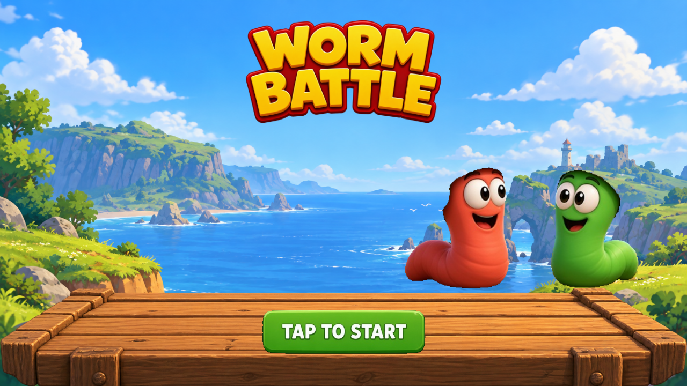
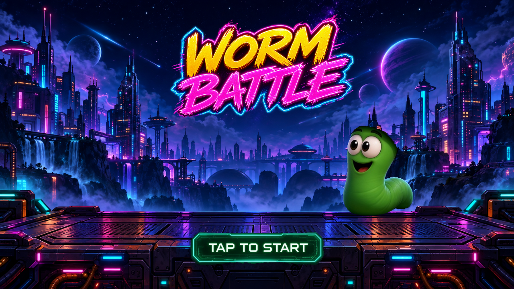

# Worms

Game bắn pháo theo lượt kiểu *Worms*, chơi online. Đồ họa 3D, gameplay trên mặt phẳng 2D. Client Unity 6 (Web, Android, Windows, macOS, Linux), server .NET 10 chạy trên Mac mini tại `chat.lazybutts.com/worms/`.

Kế hoạch đầy đủ: [docs/PLAN.md](docs/PLAN.md). Deploy: [docs/DEPLOY.md](docs/DEPLOY.md). Bàn giao đồ họa: [docs/GRAPHICS_HANDOFF.md](docs/GRAPHICS_HANDOFF.md).

## Màn hình chờ

Khi mở game, `WaitingScreen` chọn ngẫu nhiên **Coastal** hoặc **Neon**. Đây là hai bản xem trước bố cục của màn hình chờ hiện tại, dựng trong trình duyệt từ các PNG mà game sử dụng; chúng chưa phải ảnh chụp từ Unity Player.

| Coastal | Neon |
|---|---|
|  |  |

[Xem Coastal màn hình dọc](docs/visuals/waiting-coastal-portrait-500.png) · [Xem Neon màn hình dọc](docs/visuals/waiting-neon-portrait-500.png). Nhấn phím hoặc chạm nút bắt đầu để vào menu.

Mỗi bộ có 12 PNG trong [Waiting/Coastal](client/Assets/Resources/Waiting/Coastal/) và [Waiting/Neon](client/Assets/Resources/Waiting/Neon/). Khi các ảnh nền và tiêu đề đã làm sạch đều có mặt, màn hình dùng:

| Cảnh | PNG đang hiển thị |
|---|---|
| Coastal | `background.png`, `platform-solid.png`, `logo-clean.png`, `start.png`, `red-worm.png`, `green-worm.png` |
| Neon | `background.png`, `logo-clean.png`, `start.png`, `green-worm.png` |

Các lớp `sky`, `ocean`, `mountain`, `tree`, `skyscraper`, `vehicle`, `plants` và logo/sàn gốc được giữ làm phương án dự phòng khi thiếu nền hoặc ảnh đã làm sạch. Ảnh gốc do chủ dự án cung cấp nằm trong [assets-src/supplied](assets-src/supplied/README.md); nền, logo và sàn đã tạo/chỉnh lại nằm trong [assets-src/generated/runtime/waiting](assets-src/generated/runtime/waiting/).

## Đồ họa gameplay

Game đang hướng tới phong cách hoạt hình sắc nét của [ảnh tham chiếu được chọn](docs/visuals/approved-cartoon-reference.png): địa hình có lớp đất và mép cỏ, biển và đảo nhiều lớp, sâu có biểu cảm, hiệu ứng đạn/nổ, HUD và menu cùng bảng màu. Bản chạy hiện tại chưa đạt mức chi tiết và bố cục của ảnh mẫu. Có hai biome Beach và Meadow, ba mức chất lượng Low/Medium/High và tùy chọn giảm chuyển động. Nguồn gốc các asset được ghi trong [assets-src/CREDITS.md](assets-src/CREDITS.md).

Bản đồ họa hiện tại dùng chung bộ sprite sâu đỏ cho mọi đội và đổi màu thân qua shader; thêm thung lũng ở giữa bản đồ, đạo cụ tránh điểm xuất hiện, lá tiền cảnh, hiệu ứng nổ vẽ tay và HUD desktop. Bản đồ có hai bờ và thung lũng ở giữa; vách cao thay đổi cách đi bộ/nhảy. Khi các đội còn gần nhau, camera bao quát toàn trận; trên màn hình dọc, camera theo sâu đang chơi. Tiến độ đồ họa vẫn cần kiểm tra trong Unity trên các thiết bị mục tiêu.

Ảnh chụp từ development build Windows cũ được lưu trong [GRAPHICS_HANDOFF.md](docs/GRAPHICS_HANDOFF.md) làm tư liệu tiến độ; chúng không đại diện cho giao diện hiện tại.

### File ảnh gameplay

`client/Assets/Resources/` chứa **64 PNG thuộc nhóm gameplay** trong các thư mục sau; mỗi PNG có file `.meta` tương ứng. Một số ảnh cũ được giữ lại nhưng không còn được nạp.

| Thư mục | Số PNG | Nội dung |
|---|---:|---|
| [Backdrop](client/Assets/Resources/Backdrop/) | 10 | Mây, đảo, vách biển, cây, đá và đạo cụ nền. |
| [Characters](client/Assets/Resources/Characters/) | 26 | 17 sprite đỏ gồm idle, blink, aim, hai khung đi bộ, trên không, trúng đòn, cháy, chìm nước, đánh gậy, ném, bắn súng, đặt thuốc nổ, gọi không kích và tự sát; 9 ảnh xanh lam/lục/vàng cũ còn lưu nhưng `WormView` không nạp. |
| [Cosmetics](client/Assets/Resources/Cosmetics/) | 9 | Mũ, băng đô và kính; bảy món từ bộ ảnh màn chờ là vật phẩm mua được trong cửa hàng. |
| [Terrain](client/Assets/Resources/Terrain/) | 8 | Năm texture đất và ba ảnh tảng đá dùng cho các biến thể địa hình. |
| [UI](client/Assets/Resources/UI/) | 4 | Icon vũ khí, chân dung đội và lá tiền cảnh. |
| [VFX](client/Assets/Resources/VFX/) | 7 | Tên lửa, vụ nổ, khói, bụi và mảnh đất/đá. |

Các pose mới nhất là `worm-red-fire.png`, `worm-red-place.png`, `worm-red-call.png`, `worm-red-drown.png`; `worm-red-walk-b.png` và `worm-red-airborne.png` đã được vẽ lại. [Xem bản xem trước pose và mũ](docs/visuals/worm-new-pose-preview.png) (dựng trong trình duyệt để kiểm tra bố cục, chưa phải ảnh chạy trong Unity). Bản nguồn, tên ảnh gốc và công dụng của từng PNG được liệt kê trong [thư viện asset tạo cho dự án](assets-src/generated/README.md).

## Cấu trúc

| Thư mục | Nội dung |
|---|---|
| `shared/com.worms.sim` | Mô phỏng game, C# thuần, dùng chung cho client và server |
| `shared/com.worms.protocol` | Message mạng và codec nhị phân |
| `server/` | Game server (ASP.NET Core, WebSocket), đồng thời phục vụ bản Web |
| `client/` | Project Unity 6000.3.25f1 (URP; desktop, WebGL và Android) |
| `tools/` | `gen_meta.py`, `unity-check/` (compile-check code Unity không cần license) |

## Lệnh

```bash
dotnet test Worms.slnx                    # GameCore, server, protocol, sim
dotnet run --project server/Server        # http://localhost:8080, WebSocket tại /ws (chế độ khách vì chưa đặt CHAT_API_URL)
docker build -t worms:dev .               # image server (+ trang tạm nếu chưa có bản Web)
python3 tools/gen_meta.py                 # sinh .meta cho file mới trong client/Assets và shared/
```

Bản build desktop có thể chạy thẳng vào trận offline bằng tham số `-sandbox`, và chỉ định server bằng `-server ws://host:8080/ws`.

Build Unity chạy trên GitHub Actions (GameCI) sau khi thêm secret `UNITY_LICENSE`, `UNITY_EMAIL`, `UNITY_PASSWORD`.

Đợt đồ họa ngày 2026-09-27 đã qua 158 bài test .NET và build Windows/WebGL bằng Unity 6000.3.25f1 trong batch mode, không có lỗi. Giao diện WebGL khi chạy trong trình duyệt, thao tác chạm và FPS/bộ nhớ trên thiết bị thật vẫn cần kiểm tra; xem [ma trận xác minh](docs/GRAPHICS_HANDOFF.md#verification-matrix).

## Nguồn asset đồ họa

[Thư viện ảnh tạo cho dự án](assets-src/generated/README.md) lưu ảnh concept, **62 PNG nguồn trong `runtime/`** (57 ảnh gameplay và 5 ảnh màn chờ), cùng các bản nháp chưa dùng. [Bộ ảnh do chủ dự án cung cấp](assets-src/supplied/README.md) lưu nguyên bản các lớp của hai cảnh chờ; một số lớp được chép vào Unity Resources và bảy phụ kiện được dùng lại trong cửa hàng. Ảnh concept và bản nháp không được nạp làm sprite. [CREDITS.md](assets-src/CREDITS.md) ghi nguồn gốc và quyền sử dụng.
