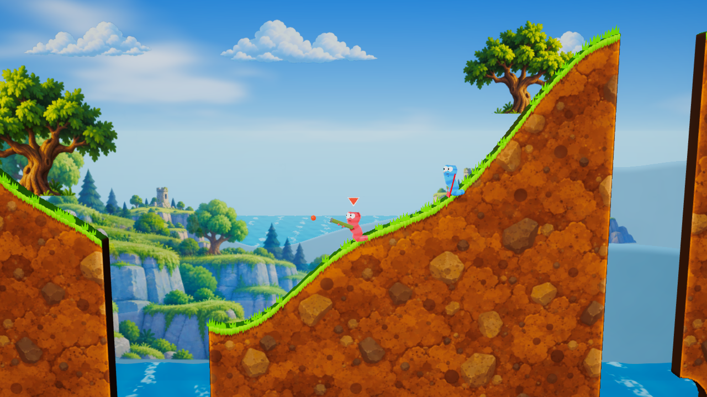
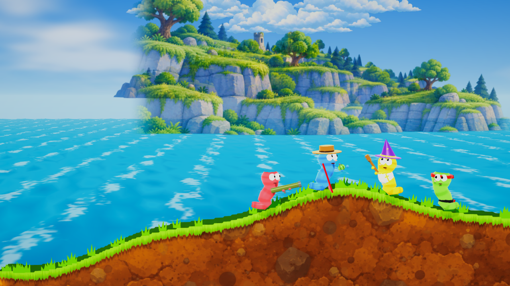

# Worms

Game bắn pháo theo lượt kiểu *Worms*, chơi online. Đồ họa 3D, gameplay trên mặt phẳng 2D. Client Unity 6 (Web, Android, Windows, macOS, Linux), server .NET 10 chạy trên Mac mini tại `chat.lazybutts.com/worms/`.

Kế hoạch đầy đủ: [docs/PLAN.md](docs/PLAN.md). Deploy: [docs/DEPLOY.md](docs/DEPLOY.md). Bàn giao đồ họa: [docs/GRAPHICS_HANDOFF.md](docs/GRAPHICS_HANDOFF.md).

## Đồ họa

Game đang hướng tới phong cách hoạt hình sắc nét của [ảnh tham chiếu được chọn](docs/visuals/approved-cartoon-reference.png): địa hình có lớp đất và mép cỏ, biển và đảo nhiều lớp, sâu có biểu cảm, hiệu ứng đạn/nổ, HUD và menu cùng bảng màu. Bản chạy hiện tại chưa đạt mức chi tiết và bố cục của ảnh mẫu. Có hai cảnh Beach và Meadow, ba mức chất lượng Low/Medium/High và tùy chọn giảm chuyển động. Nguồn gốc các asset được ghi trong [assets-src/CREDITS.md](assets-src/CREDITS.md).



Ảnh trên là **trận đấu**, không phải màn hình đầu khi mở app. Menu dùng cảnh đội sâu riêng; bản chụp camera menu sau khi chỉnh nền ở dưới cũng không gồm nút và chữ giao diện.



Ảnh tham chiếu đã chọn là **concept**, còn hai ảnh trên là camera chụp từ build thật. Địa hình hiện tại vẫn có sườn dốc lớn, sâu nhỏ hơn và ít chi tiết tiền cảnh hơn concept. Ảnh camera không chứa HUD/menu IMGUI. Xem [GRAPHICS_HANDOFF.md](docs/GRAPHICS_HANDOFF.md) để đối chiếu và biết những phần chưa đạt.

## Cấu trúc

| Thư mục | Nội dung |
|---|---|
| `shared/com.worms.sim` | Mô phỏng game, C# thuần, dùng chung cho client và server |
| `shared/com.worms.protocol` | Message mạng và codec nhị phân |
| `server/` | Game server (ASP.NET Core, WebSocket), đồng thời phục vụ bản Web |
| `client/` | Project Unity 6000.3.25f1 (URP; desktop, WebGL và Android) |
| `tools/` | `gen_meta.py`, `unity-check/` (compile-check code Unity không cần license) |

## Lệnh

```bash
dotnet test Worms.slnx                    # GameCore, server, protocol, sim
dotnet run --project server/Server        # http://localhost:8080, WebSocket tại /ws (chế độ khách vì chưa đặt CHAT_API_URL)
docker build -t worms:dev .               # image server (+ trang tạm nếu chưa có bản Web)
python3 tools/gen_meta.py                 # sinh .meta cho file mới trong client/Assets và shared/
```

Bản build desktop có thể chạy thẳng vào trận offline bằng tham số `-sandbox`, và chỉ định server bằng `-server ws://host:8080/ws`.

Build Unity chạy trên GitHub Actions (GameCI) sau khi thêm secret `UNITY_LICENSE`, `UNITY_EMAIL`, `UNITY_PASSWORD`.

Đợt đồ họa ngày 2026-09-27 đã qua 144 bài test .NET và build Windows/WebGL bằng Unity 6000.3.25f1 trong batch mode, đều không có lỗi. Giao diện WebGL khi chạy trong trình duyệt, thao tác chạm và FPS/bộ nhớ trên thiết bị thật vẫn cần kiểm tra; xem [ma trận xác minh](docs/GRAPHICS_HANDOFF.md#verification-matrix).
