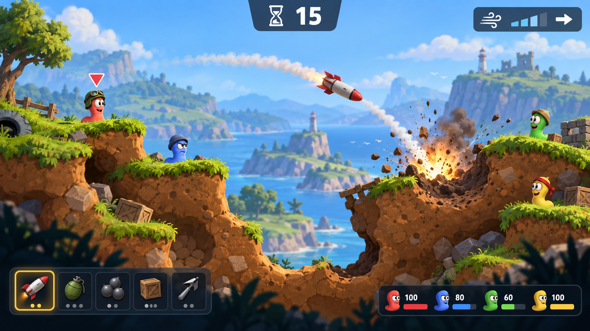
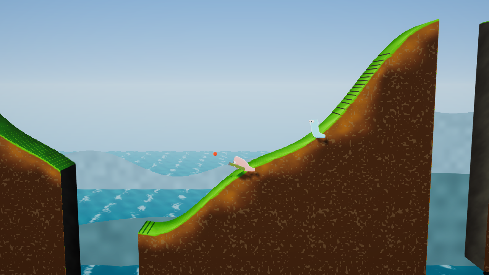
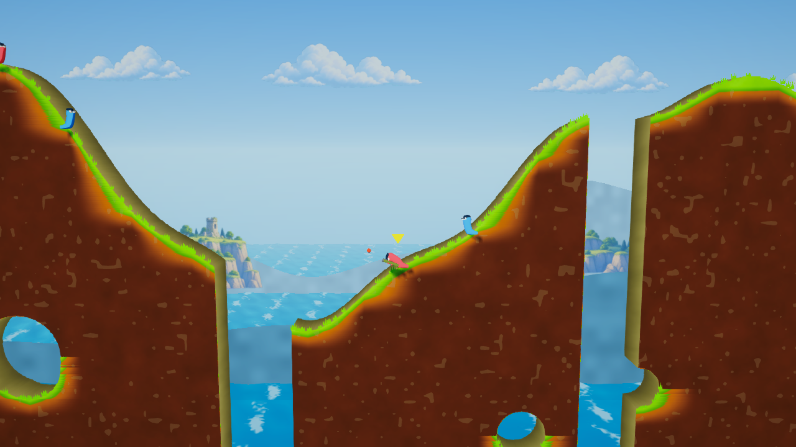

# Graphics hand-off — Worms

Status: **Art direction approved. The live game still differs substantially from the selected concept; visual acceptance and release validation are incomplete.**

## Tóm tắt bàn giao

Mục tiêu là nâng chất lượng hình ảnh **ngay trong trận đấu**: nhân vật nổi bật khỏi nền, địa hình có lớp đất và miệng hố dễ đọc, vũ khí và lượt chơi nhận ra trong một cái nhìn, menu cùng phong cách với HUD. Người dùng đã chọn ảnh tham chiếu **hoạt hình rực rỡ, nét rõ**: biển và núi xanh có chiều sâu, bờ đất lớn với mép cỏ sáng, sâu biểu cảm, hiệu ứng đạn/nổ rõ nhưng không che trận đấu, HUD tối gọn ở bốn mép.

Làm theo thứ tự trong bảng *Implementation sequence*: (1) cảnh và địa hình, (2) nhân vật và độ rõ trận đấu, (3) HUD, (4) menu vũ khí và lobby, (5) hiệu ứng và mức chất lượng, (6) kiểm tra trên thiết bị. Mỗi bước có ảnh và tiêu chí xác nhận riêng; những tiêu chí chưa kiểm tra vẫn mở dù phần triển khai của bước sau đã bắt đầu.

### Concept so với code hiện có

| Chi tiết trong concept | Hiện trạng | Cách triển khai dự kiến |
|---|---|---|
| Sâu màu sắc rõ, mắt biểu cảm | Mesh, mắt, chớp mắt, Toon shader đã có trong `WormView.cs` | Chỉnh tương phản/viền của shader và màu đội; giữ animation hiện tại |
| Địa hình có lớp đất, hố nổ | Mesh chunk và shader có độ sâu, noise, scorch đã có | Tinh chỉnh bảng màu và tần số họa tiết; kiểm tra miệng hố ở tier Low |
| Đồi xanh nhiều lớp | `SceneBuilder.cs` đã dựng ba lớp đồi | Tăng tách biệt tiền cảnh/hậu cảnh bằng màu và độ mờ, không thêm nhiều polygon |
| Thanh vũ khí, HP, lượt | `Hud.cs` đã có chức năng nhưng dùng IMGUI mặc định | Thiết kế lại style, thứ bậc và bố cục; thêm icon đơn giản, trạng thái chọn/khóa |
| Cây, hàng rào, đá, phế tích xa | Chưa có trong cảnh hiện tại | Thêm đạo cụ trang trí ít polygon, chỉ ở lớp nền hoặc bên ngoài vùng tương tác; không ảnh hưởng va chạm |
| Mũ và phụ kiện sâu | Chưa có trong nhân vật hiện tại | Xem như chi tiết mỹ thuật ở bước nhân vật; ưu tiên mắt, dáng, màu và độ rõ trước, không đổi hitbox |

## Goal

Make the match read as a polished, playful 2.5D game at desktop and mobile sizes. A player should identify the active worm, weapon, turn time, wind, and damage at a glance. Keep terrain destruction and cross-platform gameplay intact.

## Existing baseline

- Unity 6000.3.25f1, URP Forward, WebGL2 and native share the same client (`client/ProjectSettings/ProjectVersion.txt`, `docs/PLAN.md` §3.14).
- The world uses procedural meshes, two map palettes, hand-written shaders, layered hills, Shuriken particles, and a camera with follow and shake (`Render/Theme.cs`, `SceneBuilder.cs`, `Vfx.cs`, `CameraRig.cs`).
- The original branch used Unity IMGUI with basic controls. Current `main` adds `UiSkin`, a Vietnamese font, a 3D menu squad, store, named worms, and a terrain field shader. The graphics branch integrates those additions; earlier UI captures below predate the integration.
- No paid assets. Any imported art must be original or CC0 with provenance in `assets-src/CREDITS.md` (`docs/PLAN.md` §3.10).

## Art direction and alternatives

**Approved: crisp cartoon based on the user's selected image.** Chunky warm earth with a bright grass lip, cool blue sea and distant cliffs, expressive worms with large clear eyes, readable rocket smoke and impact debris, restrained bloom, and compact navy HUD panels. Keep the battlefield center open.

The user selected this generated image as the art direction. It is a visual target, not a screenshot or importable asset sheet. Match its palette, layering, silhouettes, terrain texture, and HUD hierarchy. Adapt trees, ruins, small props, and worm accessories to the game's existing destructible world without changing gameplay or exceeding the WebGL2 budget.

The user's later screenshot exposed a mistaken handoff: the displayed match camera image did not represent the opening menu, and the live world was further from this concept than the handoff implied. The current [match camera](visuals/world-current-fixed-seed.png) and [menu camera](visuals/menu-integrated-camera.png) are actual hidden Windows player renders from Unity 6000.3.25f1. The match now has broad walkable shelves, high destructible cliffs, and small alcoves in their sides. Painted soil and coastal scenery help match the palette. Worms remain comparatively small and set dressing is sparse. Both camera captures omit IMGUI, so neither verifies the live HUD or menu controls. The concept's exact cliff shapes, dense foreground, explosion composition and HUD have **not** been reproduced as shown.

This pass adds a repeating painted-soil texture (Medium/High match tiers), a non-colliding painted oak cutout behind the battle plane, a closer default battle camera, and a menu composition that reveals the coastal painting. Low match tier keeps the procedural soil shader. Trees are anchored when the match begins; crater damage beneath them can leave a cutout visually unsupported, so dynamic ground anchoring remains open. With the user's approval to change movement, the seed-based simulation map now forms broad terraces and cliffs; spawns require a short level shelf in both directions. Normal jumps cannot cross every wall, and players may need a backflip or a mobility weapon. The protocol version is 8 so an older client cannot reconstruct a different map from the same seed during an online match.

Soft clay and heavy comic inking were considered; the user selected the crisp cartoon reference above.

## Visual system

| Token | Target value | Use |
|---|---:|---|
| `ink` | `#172532` | Text, outlines, panel borders |
| `paper` | `#FFF5DE` | Primary text and light panels |
| `accent` | `#FFBE45` | Active selection, primary action |
| `danger` | `#F05D54` | Low timer, damage, errors |
| `panel` | `#142434` at 88% opacity | HUD panels over changing scenery |
| `space-1/2/3/4` | 4/8/12/16 px at 1080p reference height | Internal spacing |
| `radius-sm/md` | 8/14 px at reference height | Controls and panels |
| `stroke` | 2 px at reference height | UI borders; scale with UI |

Use a font with Vietnamese glyph coverage. Headings may be rounded and bold; numbers must have stable width so the timer and ammo do not shift. Team identity must use color **and** a shape or number. Keep game-world colors separate from UI contrast tokens.

### Match composition

- Place timer and turn owner together at top center in one dark panel. Low time (5 seconds or less) uses `danger` plus a pulse no faster than twice per second; keep the number readable with motion disabled.
- Place wind at top right with a central zero mark, directional arrow, and numeric value. Do not rely on fill color alone.
- Mark the active worm in the world with a small arrow and team number above its head. The marker stays within the camera view and does not cover the HP label.
- Put the selected weapon, ammo, fuse, and power in one bottom-left control area. Weapon picker uses an icon silhouette, name, ammo, selected outline, disabled state, and keyboard number. Avoid putting a large opaque panel over the active worm.
- Show team health as current/max text and bar, with a team number. Derive max from match setup or starting HP rather than a fixed 400.
- Draw damage popups and explosions above the world, but below critical HUD text. Reduce particles before reducing worm or projectile readability on low tier.

### World styling

- Keep the existing two biome palettes but tune foreground/background separation: terrain and worms have stronger local contrast than distant hills. Test both Meadow and Beach at minimum and maximum camera zoom.
- Give the topsoil a deliberate graphic band and sparse large-scale pattern; avoid dense high-frequency noise that shimmers at 0.7 render scale. Ensure crater walls remain identifiable after repeated explosions.
- Give worms a subtle edge treatment and one bright highlight, but do not flatten their existing toon shading. Team colors must remain distinct against both biomes and color-blind viewing modes.
- Preserve visible projectile paths and impact points. Flash and shake should have reduced-motion variants; neither may hide the active worm or aiming target.

## Layout and interaction rules

Reference layout is 1920×1080. Scale UI from the shorter screen dimension, clamp control text to a readable minimum, and use `Screen.safeArea`. At widths below 700 px, collapse health bars into a compact row and make the weapon picker two columns with vertical scrolling. At widths below 420 px, move sound and quality controls into a settings panel rather than covering gameplay. Use the same state vocabulary in menu and match: default, hover/focus, pressed, selected, disabled, loading, and error. Pointer targets must be at least 44×44 logical pixels on touch devices.

Keyboard: Tab opens/closes weapons; 1–8 select an available weapon; Escape closes the picker. Clicking or tapping outside dismisses it, and aiming input is blocked while it is open. Touch: picker opens from a persistent button and must not overlap the fire or movement targets. Keep the active controls usable when names are 24 characters or Vietnamese text wraps.

## Implementation sequence

Each step is a reviewable increment. Finish its verification before proceeding.

| Step | Deliverable | Primary files | Acceptance evidence |
|---|---|---|---|
| 1. World pass | Tune Meadow/Beach terrain, sky, sea, lighting and background separation; add inexpensive non-interactive scenery | `Render/Theme.cs`; `SceneBuilder.cs`; `Resources/Shaders/Terrain.shader`; `Backdrop.shader`; `Water.shader` | Side-by-side capture for both biomes at Low and High tier; craters read after multiple blasts; props never obscure worms |
| 2. Characters and readability | Improve worm edge treatment and expressions, optionally add small accessories, mark active worm; keep projectile visible | `Render/WormView.cs`; `Render/ActorViews.cs`; `Resources/Shaders/Toon.shader` | Four teams distinguishable with grayscale preview; active worm and projectile visible at zoom extremes |
| 3. HUD foundation | Shared palette and typography, safe-area layout, responsive styles; timer/wind/weapon/health hierarchy | `UI/Hud.cs`; extract shared styles when menu work starts | Screenshots at 1920×1080, 1280×720, 390×844; no clipped controls; Vietnamese text legible |
| 4. Weapon and menu polish | Icon set or procedural silhouettes; picker and lobby visual states match HUD | `UI/Hud.cs`; `UI/MenuUI.cs`; new UI asset files only if needed | Mouse, keyboard, and touch paths work; 24-character names and errors fit |
| 5. Effects and quality | Clearer projectile/impact effects, reduced-motion toggle, balanced Low/Medium/High tiers | `Render/Vfx.cs`; `Render/UrpSetup.cs`; `Render/QualitySettingsManager.cs` | WebGL2 and native visuals checked; 30 FPS floor on mobile target from `docs/PLAN.md` §3.14 |
| 6. Release review | Full visual regression and documented choices | `docs/GRAPHICS_HANDOFF.md`; `assets-src/CREDITS.md` if assets added | Screenshot matrix, device notes, `dotnet test Worms.slnx`, Unity compile/build, no unlicensed assets |

## Verification matrix

### Current game renders

The following two images use the same offline sandbox seed (`123456`), 1280×720 camera render, Windows player, High tier, and a disposable Unity **6000.6.3f1** copy. The source project remains set to 6000.3.25f1. This comparison demonstrates the current direction but does not validate the required editor version, WebGL2, mobile performance, or the HUD.

| Original source at `7d74ffb` | Graphics pass in progress |
|---|---|
|  |  |

Observed changes: wider camera framing; stronger team colors and active-worm arrow; warm soil and grass band; cell-edge striping reduced; grass tufts rebuild after craters; painted distant islands and cloud banks. The world remains more geometric and sparse than the approved art reference. More work is needed on terrain texture, vegetation and cliffs, character expression, and HUD verification. These images are camera captures, so UI is absent by design.

A historical [stone-inlay experiment](visuals/world-stones-fixed-seed.png) added sparse faceted rocks to solid terrain faces. It was removed during integration with `main`, whose new terrain-field shader already paints embedded stones, grass and crater rims. Rendering both systems together made the soil too busy. This image documents the experiment, not the current code.

The next background pass adds one painted midground island with broad cliffs and trees, placed behind the play plane with no collider. Hidden camera captures in [Beach](visuals/world-island-beach.png) and [Meadow](visuals/world-island-meadow.png) show it filling some of the empty sea gap while leaving the worm and projectile area readable. The asset uses the user-approved reference palette and is credited in `assets-src/CREDITS.md`. It is a single textured quad; no new per-frame mesh work is introduced. These captures do not establish mobile frame rate or browser rendering.

The character pass gave the active-worm marker the reference's red center and pale outline. The marker scales with camera distance so it stays a similar pixel size at normal and close zoom. Hidden camera captures at [normal zoom](visuals/worm-face-wide.png) and [close zoom](visuals/worm-face-closeup.png) show the earlier face experiment. During integration, the newer `main` worm face (large eyes, glints, mouth and cheek), cosmetics, and segmented shader replaced that experiment. The marker remains. Other poses, maximum zoom-out, and four-team color distinction remain to be inspected.

The **earlier** integrated world was captured at 1280×720 in [Beach High](visuals/world-integrated-main-beach.png), [Beach Low](visuals/world-integrated-main-beach-low.png), and [Meadow High](visuals/world-integrated-main-meadow.png). These historical hidden camera-only captures use fixed sandbox seeds `123456` and `123457`, and a disposable Unity 6000.6.3f1 editor. The current 6000.3.25f1 [match capture](visuals/world-current-fixed-seed.png) supersedes them for visual comparison. GUI is absent by design.

Meadow was also captured at 1280×720 in [Low](visuals/world-meadow-low.png) and [High](visuals/world-meadow-high.png) tiers with the painted islands. The Low/High difference is subtle in these still frames; performance has not been measured.

The pre-integration HUD was captured at [1280×720](visuals/hud-1280x720.png), [390×844](visuals/hud-390x844.png), and with the weapon picker in [desktop](visuals/hud-picker.png) and [portrait](visuals/hud-picker-portrait.png). These images are historical. The current branch uses `main`'s named-worm tags, turn order, reward panel, Vietnamese font and rounded UI skin, plus the graphics branch's weapon icons, team portraits, safe-area placement, numeric wind, reduced-motion treatment, and picker dismissal. The ninth weapon, Napalm, has a text cell because the generated sheet has eight icons. Current GUI layout has compiled but has not been visually recaptured under the user's no-focus constraint. Connected lobby, store, long names, four-team layout and touch interaction remain unverified visually.

The [outdated-client](visuals/hud-menu.png), [offline](visuals/menu-offline.png), and [login](visuals/menu-login.png) desktop captures, plus [offline portrait](visuals/menu-offline-portrait.png), [login portrait](visuals/menu-login-portrait.png), and [settings portrait](visuals/menu-settings-portrait.png), also predate integration. Current `main` adds an animated 3D squad, store, and name editor. The merged menu preserves 44 px portrait controls and a separate portrait settings overlay with quality and reduced-motion choices. Its current layout has not been visually recaptured without a visible window.

After a user reported that the built app's opening menu did not resemble the approved visual direction, we traced the difference to two separate scenes: the README image showed a match, while the menu used a close camera and procedural hills that hid the painted scenery. The menu now uses a smaller painted cliff/island composition with visible sky and clouds, a wider camera, and a soft edge on the island image. Its hidden 1280×720 [camera-only capture](visuals/menu-integrated-camera.png) shows the result under Unity 6000.3.25f1. This capture excludes IMGUI. Near-square windows now use the compact settings overlay, matching the menu column's layout breakpoint. The user's reported layout remains the evidence for the previous UI issue; current IMGUI still needs visual review without taking focus.

**Open verification:** real mobile portrait/landscape, WebGL2 browser runtime, FPS and memory on mobile browser, connected-lobby and game-over captures, long names, four teams and touch interaction.

On 2026-09-27, the terraced-map branch passed all **156 .NET tests** (48 GameCore, 32 Server, 10 Protocol, 66 Sim). The added tests cover cliff and shelf generation, safe spawn ground on seven named seeds and 32 sequential seeds, and soil shading inside buried cavities. The Unity C# check built with zero warnings and errors. Windows and WebGL builds succeeded with zero errors under the project's pinned **Unity 6000.3.25f1** editor. The current [Beach](visuals/world-current-fixed-seed.png) and [Meadow](visuals/world-terraces-meadow.png) captures come from a Windows player with a preview-only camera helper; they omit IMGUI. The earlier 6000.6.3f1 captures remain historical evidence. Browser runtime, touch interaction, GUI layout, and mobile FPS/memory remain unverified. Although the editor and player were started with hidden-window flags, the user reported repeated focus loss. Those flags did not reliably protect focus, so no further Unity/player launches were made after that report.

[High](visuals/explosion-high.png) and [Low](visuals/explosion-low.png) explosion captures show the quality-tier difference in particle density. These are forced VFX states in the disposable preview, not a full gameplay shot with a resulting crater. Reduced motion disables camera shake, active-marker bob, victory hop, and popup rise, and lowers particle density; the setting is implemented and compiled, but its interactive behavior has not been visually verified.

Capture menu, lobby, aiming, flying, explosion, game-over, and disconnected/error states. Repeat on desktop 16:9, mobile portrait, and mobile landscape; repeat match scenes in both biomes and Low/High tiers. Verify WebGL2 on an actual browser and one native build. Inspect readability at camera distances 9 and 60 (`CameraRig.cs`). Test reduced motion, a long Vietnamese name, four teams, zero ammo, no connection, and repeated terrain destruction. Record FPS and memory on the mobile browser before and after world/VFX changes. The .NET suite checks simulation and UI-independent logic; it does not establish rendered quality.

## Boundaries

Do not alter simulation, protocol, match outcomes, or platform parity for an art change. Keep all graphics features compatible with WebGL2 and Unity 6000.3.25f1. Do not open the project in a newer editor and commit automatic migration changes. Keep source asset licenses recorded. If a visual feature misses the mobile target, simplify that feature in Low tier while preserving gameplay readability.
