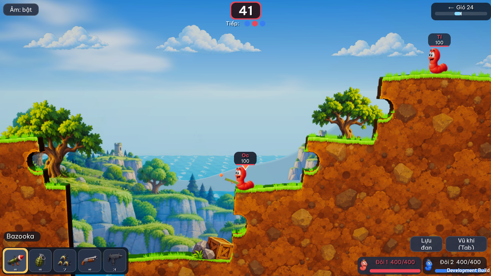
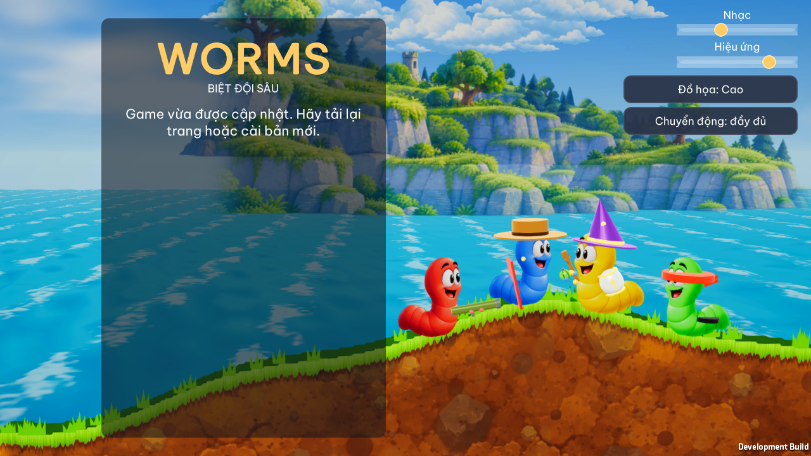

# Graphics hand-off — Worms

Status: **Art direction approved. The live game still differs substantially from the selected concept; visual acceptance and release validation are incomplete.**

## Tóm tắt bàn giao

Mục tiêu là nâng chất lượng hình ảnh **ngay trong trận đấu**: nhân vật nổi bật khỏi nền, địa hình có lớp đất và miệng hố dễ đọc, vũ khí và lượt chơi nhận ra trong một cái nhìn, menu cùng phong cách với HUD. Người dùng đã chọn ảnh tham chiếu **hoạt hình rực rỡ, nét rõ**: biển và núi xanh có chiều sâu, bờ đất lớn với mép cỏ sáng, sâu biểu cảm, hiệu ứng đạn/nổ rõ nhưng không che trận đấu, HUD tối gọn ở bốn mép.

Làm theo thứ tự trong bảng *Implementation sequence*: (1) cảnh và địa hình, (2) nhân vật và độ rõ trận đấu, (3) HUD, (4) menu vũ khí và lobby, (5) hiệu ứng và mức chất lượng, (6) kiểm tra trên thiết bị. Mỗi bước có ảnh và tiêu chí xác nhận riêng; những tiêu chí chưa kiểm tra vẫn mở dù phần triển khai của bước sau đã bắt đầu.

### Concept so với code hiện có

| Chi tiết trong concept | Hiện trạng | Cách triển khai dự kiến |
|---|---|---|
| Sâu màu sắc rõ, mắt biểu cảm | Mesh, mắt, chớp mắt, Toon shader đã có trong `WormView.cs` | Chỉnh tương phản/viền của shader và màu đội; giữ animation hiện tại |
| Địa hình có lớp đất, hố nổ | Mesh chunk và shader có độ sâu, noise, scorch đã có | Tinh chỉnh bảng màu và tần số họa tiết; kiểm tra miệng hố ở tier Low |
| Đồi xanh nhiều lớp | `SceneBuilder.cs` đã dựng ba lớp đồi | Tăng tách biệt tiền cảnh/hậu cảnh bằng màu và độ mờ, không thêm nhiều polygon |
| Thanh vũ khí, HP, lượt | `Hud.cs` đã có chức năng nhưng dùng IMGUI mặc định | Thiết kế lại style, thứ bậc và bố cục; thêm icon đơn giản, trạng thái chọn/khóa |
| Cây, hàng rào, đá, phế tích xa | Chưa có trong cảnh hiện tại | Thêm đạo cụ trang trí ít polygon, chỉ ở lớp nền hoặc bên ngoài vùng tương tác; không ảnh hưởng va chạm |
| Mũ và phụ kiện sâu | Chưa có trong nhân vật hiện tại | Xem như chi tiết mỹ thuật ở bước nhân vật; ưu tiên mắt, dáng, màu và độ rõ trước, không đổi hitbox |

## Goal

Make the match read as a polished, playful 2.5D game at desktop and mobile sizes. A player should identify the active worm, weapon, turn time, wind, and damage at a glance. Keep terrain destruction and cross-platform gameplay intact.

## Existing baseline

- Unity 6000.3.25f1, URP Forward, WebGL2 and native share the same client (`client/ProjectSettings/ProjectVersion.txt`, `docs/PLAN.md` §3.14).
- The world uses procedural meshes, two map palettes, hand-written shaders, layered hills, Shuriken particles, and a camera with follow and shake (`Render/Theme.cs`, `SceneBuilder.cs`, `Vfx.cs`, `CameraRig.cs`).
- The original branch used Unity IMGUI with basic controls. Current `main` adds `UiSkin`, a Vietnamese font, a 3D menu squad, store, named worms, and a terrain field shader. The graphics branch integrates those additions; earlier UI captures below predate the integration.
- No paid assets. Any imported art must be original or CC0 with provenance in `assets-src/CREDITS.md` (`docs/PLAN.md` §3.10).

## Art direction and alternatives

**Approved: crisp cartoon based on the user's selected image.** Chunky warm earth with a bright grass lip, cool blue sea and distant cliffs, expressive worms with large clear eyes, readable rocket smoke and impact debris, restrained bloom, and compact navy HUD panels. Keep the battlefield center open.

The user selected this generated image as the art direction. It is a visual target, not a screenshot or importable asset sheet. Match its palette, layering, silhouettes, terrain texture, and HUD hierarchy. The user subsequently approved map geometry changes to get closer to its terraces. Keep the destructible simulation and WebGL2 budget intact.

The original concept PNG, an art direction sheet, all 15 generated images imported by Unity, and five unused generated variants are preserved in [the source asset library](../assets-src/generated/README.md). The selected concept is `assets-src/generated/concept/approved-battle.png`; its copy above is byte-identical. Runtime originals are byte-identical to their matching `client/Assets/Resources/` files. The concept sheet is a reference composition, not a Unity sprite atlas.

### Current concept rebuild in progress

Four new transparent worm cutouts derived from the approved image are wired into `WormView` on the `feat/concept-character-rebuild` branch. Their texture import disables NPOT rescaling so the UV crops continue to match the source pixels; the painted body receives the hit flash. The old procedural body remains a fallback if the images are unavailable; weapons and cosmetics still use their 3D attachments. The revised seed map forms a broad central basin with high side shelves, and spawns begin within the central battle area. Desktop camera framing includes all living worms while they occupy a compact region; portrait camera follows the active worm. The new foreground foliage, crate/rocks cutout and short-lived painted explosion add the reference's layered look. Crates avoid initial worm positions, and anchored props move or disappear when their terrain support is destroyed. The desktop HUD shows five weapon icons at bottom left and team health at bottom right. A local Mono development preview build runs on a separate Windows desktop using `tools/Run-IsolatedDesktop.ps1`; it writes a screenshot through a development-only capture path without displaying a window on the user's desktop. The release path still uses IL2CPP. Runtime captures verify that these assets render, but **do not establish full concept fidelity**.

| Four-team battle preview, seed 123456, 1280×720, HUD included | Menu preview, 1280×720, GUI included |
|---|---|
|  |  |

The four-team preview now shows red, blue, yellow and green worms on opposing shelves around an open valley. Its terrain collision mask uses wider, irregular cliff transitions, captured from the latest Windows player build. [Flight](visuals/concept-rebuild-shot-flight.png), [impact](visuals/concept-rebuild-shot-impact.png) and [settled aftermath](visuals/concept-rebuild-shot-aftermath.png) come from sandbox input, simulation ticks and the current projectile renderer at seed 123456. The painted rocket and denser smoke trail keep all four worms framed; the blast carves the cliff and the green worm lands on the new slope. Tree and crate anchors remain implemented, but repeated destruction across varied seeds has not been visually checked. The [default two-team battle](visuals/concept-rebuild-two-team-preview.png) and [390×844 portrait](visuals/concept-rebuild-portrait-preview.png) are real player output from the previous terrain revision. The [VFX preview](visuals/concept-rebuild-vfx-preview.png) fires the actual `Vfx.Explosion` renderer at a fixed surface point and is separate from the full shot. The menu preview shows all four characters together, but its separate island composition and server-version message remain unlike the selected battle image. The painted terrain still looks flatter and more regular than the concept's sculpted rock cliffs; worms are small in the four-team overview and the sky dominates the frame. Varied props, responsive controls, WebGL browser runtime and mobile performance remain open. The earlier camera-only shots below are historical.

The seed 123456 central valley has dry land above the waterline, confirmed by a focused simulation test. Moving the overview camera downward brought the left cliff too close to the top edge, so that experiment was reverted. Removing the generated round caves changed safe spawn positions and pushed two worms near the water; that map experiment was also reverted. The current captures and gameplay geometry retain the previously validated four-team composition.

The current Medium/High terrain shader grades the generated orange soil texture toward deeper brown and adds broad value variation. A Windows player capture at seed 123456 shows that the grass lip and carved edge remain readable after the shot; Low tier still uses its procedural soil treatment and needs a separate visual pass. The team HUD now subtracts pending damage immediately, so the green team reads `67/100` during the captured `-33` hit instead of showing `100/100` until turn settlement. WebGL shader performance after this change remains unmeasured.

The user's later screenshot exposed a mistaken handoff: the displayed match camera image did not represent the opening menu, and the live world was further from this concept than the handoff implied. The earlier [match camera](visuals/world-current-fixed-seed.png) and [menu camera](visuals/menu-integrated-camera.png) are historical hidden Windows player renders from Unity 6000.3.25f1. They omit IMGUI and are superseded by the screenshots above.

This pass adds a repeating painted-soil texture (Medium/High match tiers), non-colliding scenery cutouts, camera framing for group and portrait play, and a menu composition that reveals the coastal painting. Low match tier keeps the procedural soil shader. Trees and crates now refresh their ground anchor after explosions, hiding if the ground drops too far. With the user's approval to change movement, the seed-based simulation map forms broad terraces, a central basin and cliffs; spawns require a short level shelf in both directions. Normal jumps cannot cross every wall, and players may need a backflip or a mobility weapon. The protocol version is **9** so an older client cannot reconstruct the changed map or spawn distribution from the same seed during an online match.

Soft clay and heavy comic inking were considered; the user selected the crisp cartoon reference above.

## Visual system

| Token | Target value | Use |
|---|---:|---|
| `ink` | `#172532` | Text, outlines, panel borders |
| `paper` | `#FFF5DE` | Primary text and light panels |
| `accent` | `#FFBE45` | Active selection, primary action |
| `danger` | `#F05D54` | Low timer, damage, errors |
| `panel` | `#142434` at 88% opacity | HUD panels over changing scenery |
| `space-1/2/3/4` | 4/8/12/16 px at 1080p reference height | Internal spacing |
| `radius-sm/md` | 8/14 px at reference height | Controls and panels |
| `stroke` | 2 px at reference height | UI borders; scale with UI |

Use a font with Vietnamese glyph coverage. Headings may be rounded and bold; numbers must have stable width so the timer and ammo do not shift. Team identity must use color **and** a shape or number. Keep game-world colors separate from UI contrast tokens.

### Match composition

- Place timer and turn owner together at top center in one dark panel. Low time (5 seconds or less) uses `danger` plus a pulse no faster than twice per second; keep the number readable with motion disabled.
- Place wind at top right with a central zero mark, directional arrow, and numeric value. Do not rely on fill color alone.
- Mark the active worm in the world with a small arrow and team number above its head. The marker stays within the camera view and does not cover the HP label.
- Put the selected weapon, ammo, fuse, and power in one bottom-left control area. Weapon picker uses an icon silhouette, name, ammo, selected outline, disabled state, and keyboard number. Avoid putting a large opaque panel over the active worm.
- Show team health as current/max text and bar, with a team number. Derive max from match setup or starting HP rather than a fixed 400.
- Draw damage popups and explosions above the world, but below critical HUD text. Reduce particles before reducing worm or projectile readability on low tier.

### World styling

- Keep the existing two biome palettes but tune foreground/background separation: terrain and worms have stronger local contrast than distant hills. Test both Meadow and Beach at minimum and maximum camera zoom.
- Give the topsoil a deliberate graphic band and sparse large-scale pattern; avoid dense high-frequency noise that shimmers at 0.7 render scale. Ensure crater walls remain identifiable after repeated explosions.
- Give worms a subtle edge treatment and one bright highlight, but do not flatten their existing toon shading. Team colors must remain distinct against both biomes and color-blind viewing modes.
- Preserve visible projectile paths and impact points. Flash and shake should have reduced-motion variants; neither may hide the active worm or aiming target.

## Layout and interaction rules

Reference layout is 1920×1080. Scale UI from the shorter screen dimension, clamp control text to a readable minimum, and use `Screen.safeArea`. At widths below 700 px, collapse health bars into a compact row and make the weapon picker two columns with vertical scrolling. At widths below 420 px, move sound and quality controls into a settings panel rather than covering gameplay. Use the same state vocabulary in menu and match: default, hover/focus, pressed, selected, disabled, loading, and error. Pointer targets must be at least 44×44 logical pixels on touch devices.

Keyboard: Tab opens/closes weapons; 1–8 select an available weapon; Escape closes the picker. Clicking or tapping outside dismisses it, and aiming input is blocked while it is open. Touch: picker opens from a persistent button and must not overlap the fire or movement targets. Keep the active controls usable when names are 24 characters or Vietnamese text wraps.

## Implementation sequence

Each step is a reviewable increment. Finish its verification before proceeding.

| Step | Deliverable | Primary files | Acceptance evidence |
|---|---|---|---|
| 1. World pass | Tune Meadow/Beach terrain, sky, sea, lighting and background separation; add inexpensive non-interactive scenery | `Render/Theme.cs`; `SceneBuilder.cs`; `Resources/Shaders/Terrain.shader`; `Backdrop.shader`; `Water.shader` | Side-by-side capture for both biomes at Low and High tier; craters read after multiple blasts; props never obscure worms |
| 2. Characters and readability | Improve worm edge treatment and expressions, optionally add small accessories, mark active worm; keep projectile visible | `Render/WormView.cs`; `Render/ActorViews.cs`; `Resources/Shaders/Toon.shader` | Four teams distinguishable with grayscale preview; active worm and projectile visible at zoom extremes |
| 3. HUD foundation | Shared palette and typography, safe-area layout, responsive styles; timer/wind/weapon/health hierarchy | `UI/Hud.cs`; extract shared styles when menu work starts | Screenshots at 1920×1080, 1280×720, 390×844; no clipped controls; Vietnamese text legible |
| 4. Weapon and menu polish | Icon set or procedural silhouettes; picker and lobby visual states match HUD | `UI/Hud.cs`; `UI/MenuUI.cs`; new UI asset files only if needed | Mouse, keyboard, and touch paths work; 24-character names and errors fit |
| 5. Effects and quality | Clearer projectile/impact effects, reduced-motion toggle, balanced Low/Medium/High tiers | `Render/Vfx.cs`; `Render/UrpSetup.cs`; `Render/QualitySettingsManager.cs` | WebGL2 and native visuals checked; 30 FPS floor on mobile target from `docs/PLAN.md` §3.14 |
| 6. Release review | Full visual regression and documented choices | `docs/GRAPHICS_HANDOFF.md`; `assets-src/CREDITS.md` if assets added | Screenshot matrix, device notes, `dotnet test Worms.slnx`, Unity compile/build, no unlicensed assets |

## Verification matrix

### Current merge checkpoint (2026-09-28)

The local continuation adds four production PNGs derived from the approved art direction: `Resources/UI/napalm-icon.png` fills the ninth weapon slot, `Resources/Backdrop/coastal-citadel.png` supplies the distant right-hand lighthouse and ruins, `Resources/Backdrop/coastal-range-left.png` supplies layered cliffs on the left, and `Resources/Backdrop/grass-rock-clump.png` adds painted vegetation to stable terrain shelves. The clumps are anchored to destructible terrain and hide when their support falls away. All four are transparent cutouts with source copies and Unity import metadata. Their alpha and source/runtime byte identity were checked, but their placement, browser rendering, and memory cost have not yet been verified in a Unity player. The existing preview images below predate these additions.

The painted worms in matches are now drawn at 1.4× their former size, anchored at the same foot line. The active marker and name/HP labels move above the enlarged art; menu worm scale and simulation collision stay unchanged. This still needs a player capture to check separation at all camera distances and portrait sizes.

The four character PNG import caps are reduced to 1024 px. Their UV crops now use original source dimensions rather than Unity's possibly downsampled texture dimensions, so the painted body should keep the same framing across import tiers. The four new backdrop/UI textures have import caps of 1024/512/256 px according to displayed size. Source PNGs remain full resolution. Unity runtime quality and device memory use still need direct inspection.

A new `stratified-soil.png` PNG replaces the round-clod look of the earlier soil texture with broader horizontal cliff strata and darker seams. The old PNG remains as a fallback in `Materials.Terrain`; Low/Medium/High tiers blend the new painted material at increasing strength. Edge-color sampling on the source PNG found a modest top/bottom seam, so a real match capture is still needed before accepting the repeat pattern or the color grade.

Four new transparent `worm-*-aim.png` cutouts give the red, blue, yellow and green teams a concentrated aiming expression. Their alpha bounds and canvas sizes were checked against one another. `WormView` switches to the aiming cutout only while the worm is holding a weapon, using the same source-space crop as the idle cutout; the original sprite remains available for other states and as a fallback if an aim image is missing. The transition, accessory overlap and shot alignment need player inspection.

The [four-team Windows preview](visuals/concept-rebuild-battle-preview.png) uses the newly generated `sculpted-soil.png` terrain texture. Its original generated PNG is preserved in `assets-src/generated/runtime/terrain/` and the exact runtime copy lives in `client/Assets/Resources/Terrain/`. A Unity 6000.3.25f1 Windows preview build completed with zero errors, and the player was captured on a separate Windows desktop without taking focus. The painted rock masses are clearer, but the cliff silhouette, character scale, composition and HUD still differ substantially from the approved concept. The flight, impact and aftermath images below predate this texture change; they document the actual projectile and crater behavior, not final visual fidelity. WebGL browser rendering and mobile performance remain unverified.

### Current game renders

The following two images use the same offline sandbox seed (`123456`), 1280×720 camera render, Windows player, High tier, and a disposable Unity **6000.6.3f1** copy. The source project remains set to 6000.3.25f1. This comparison demonstrates the current direction but does not validate the required editor version, WebGL2, mobile performance, or the HUD.

| Original source at `7d74ffb` | Graphics pass in progress |
|---|---|
|  |  |

Observed changes: wider camera framing; stronger team colors and active-worm arrow; warm soil and grass band; cell-edge striping reduced; grass tufts rebuild after craters; painted distant islands and cloud banks. The world remains more geometric and sparse than the approved art reference. More work is needed on terrain texture, vegetation and cliffs, character expression, and HUD verification. These images are camera captures, so UI is absent by design.

A historical [stone-inlay experiment](visuals/world-stones-fixed-seed.png) added sparse faceted rocks to solid terrain faces. It was removed during integration with `main`, whose new terrain-field shader already paints embedded stones, grass and crater rims. Rendering both systems together made the soil too busy. This image documents the experiment, not the current code.

The next background pass adds one painted midground island with broad cliffs and trees, placed behind the play plane with no collider. Hidden camera captures in [Beach](visuals/world-island-beach.png) and [Meadow](visuals/world-island-meadow.png) show it filling some of the empty sea gap while leaving the worm and projectile area readable. The asset uses the user-approved reference palette and is credited in `assets-src/CREDITS.md`. It is a single textured quad; no new per-frame mesh work is introduced. These captures do not establish mobile frame rate or browser rendering.

The character pass gave the active-worm marker the reference's red center and pale outline. The marker scales with camera distance so it stays a similar pixel size at normal and close zoom. Hidden camera captures at [normal zoom](visuals/worm-face-wide.png) and [close zoom](visuals/worm-face-closeup.png) show the earlier face experiment. During integration, the newer `main` worm face (large eyes, glints, mouth and cheek), cosmetics, and segmented shader replaced that experiment. The marker remains. Other poses, maximum zoom-out, and four-team color distinction remain to be inspected.

The **earlier** integrated world was captured at 1280×720 in [Beach High](visuals/world-integrated-main-beach.png), [Beach Low](visuals/world-integrated-main-beach-low.png), and [Meadow High](visuals/world-integrated-main-meadow.png). These historical hidden camera-only captures use fixed sandbox seeds `123456` and `123457`, and a disposable Unity 6000.6.3f1 editor. The current 6000.3.25f1 [match capture](visuals/world-current-fixed-seed.png) supersedes them for visual comparison. GUI is absent by design.

Meadow was also captured at 1280×720 in [Low](visuals/world-meadow-low.png) and [High](visuals/world-meadow-high.png) tiers with the painted islands. The Low/High difference is subtle in these still frames; performance has not been measured.

The pre-integration HUD was captured at [1280×720](visuals/hud-1280x720.png), [390×844](visuals/hud-390x844.png), and with the weapon picker in [desktop](visuals/hud-picker.png) and [portrait](visuals/hud-picker-portrait.png). These images are historical. The current branch uses `main`'s named-worm tags, turn order, reward panel, Vietnamese font and rounded UI skin, plus the graphics branch's weapon icons, team portraits, safe-area placement, numeric wind, reduced-motion treatment, and picker dismissal. The ninth weapon, Napalm, has a text cell because the generated sheet has eight icons. Current GUI layout has compiled but has not been visually recaptured under the user's no-focus constraint. Connected lobby, store, long names, four-team layout and touch interaction remain unverified visually.

The [outdated-client](visuals/hud-menu.png), [offline](visuals/menu-offline.png), and [login](visuals/menu-login.png) desktop captures, plus [offline portrait](visuals/menu-offline-portrait.png), [login portrait](visuals/menu-login-portrait.png), and [settings portrait](visuals/menu-settings-portrait.png), also predate integration. Current `main` adds an animated 3D squad, store, and name editor. The merged menu preserves 44 px portrait controls and a separate portrait settings overlay with quality and reduced-motion choices. Its current layout has not been visually recaptured without a visible window.

After a user reported that the built app's opening menu did not resemble the approved visual direction, we traced the difference to two separate scenes: the README image showed a match, while the menu used a close camera and procedural hills that hid the painted scenery. The menu now uses a smaller painted cliff/island composition with visible sky and clouds, a wider camera, and a soft edge on the island image. Its hidden 1280×720 [camera-only capture](visuals/menu-integrated-camera.png) shows the result under Unity 6000.3.25f1. This capture excludes IMGUI. Near-square windows now use the compact settings overlay, matching the menu column's layout breakpoint. The user's reported layout remains the evidence for the previous UI issue; current IMGUI still needs visual review without taking focus.

**Open verification:** real mobile portrait/landscape, WebGL2 browser runtime, FPS and memory on mobile browser, connected-lobby and game-over captures, long names, four teams and touch interaction.

On 2026-09-27, the earlier terraced-map pass passed **156 .NET tests** (48 GameCore, 32 Server, 10 Protocol, 66 Sim). The current central-basin and wider-cliff revision passed **158 .NET tests** (48 GameCore, 32 Server, 10 Protocol, 68 Sim), including 11 focused terrain and spawn tests. The Unity C# check built with zero warnings and errors. Windows and WebGL builds succeeded with zero errors under the project's pinned **Unity 6000.3.25f1** editor. The [Beach](visuals/world-current-fixed-seed.png) and [Meadow](visuals/world-terraces-meadow.png) captures are historical camera-only shots. Browser runtime, touch interaction, and mobile FPS/memory remain unverified. Earlier hidden-window launches stole focus; subsequent Unity editor and player launches use a separate Windows desktop via `tools/Run-IsolatedDesktop.ps1`, without switching the user's desktop.

[High](visuals/explosion-high.png) and [Low](visuals/explosion-low.png) explosion captures show the quality-tier difference in particle density. These are forced VFX states in the disposable preview, not a full gameplay shot with a resulting crater. Reduced motion disables camera shake, active-marker bob, victory hop, and popup rise, and lowers particle density; the setting is implemented and compiled, but its interactive behavior has not been visually verified.

Capture menu, lobby, aiming, flying, explosion, game-over, and disconnected/error states. Repeat on desktop 16:9, mobile portrait, and mobile landscape; repeat match scenes in both biomes and Low/High tiers. The current WebGL build completed successfully with zero build errors, but WebGL2 runtime still needs verification in an actual browser. Inspect readability at camera distances 9 and 60 (`CameraRig.cs`). Test reduced motion, a long Vietnamese name, four teams, zero ammo, no connection, and repeated terrain destruction. Record FPS and memory on the mobile browser before and after world/VFX changes. The .NET suite checks simulation and UI-independent logic; it does not establish rendered quality.

## Boundaries

Do not alter simulation, protocol, match outcomes, or platform parity for an art change. Keep all graphics features compatible with WebGL2 and Unity 6000.3.25f1. Do not open the project in a newer editor and commit automatic migration changes. Keep source asset licenses recorded. If a visual feature misses the mobile target, simplify that feature in Low tier while preserving gameplay readability.

The four teams now have transparent hurt-reaction sprites in addition to idle and aim poses. WormView displays the matching hurt pose for 0.45 seconds after a hit and throughout tumbling, with the same source-space crop and foot anchor. These transitions still need inspection in a Unity player; gameplay logic is unchanged.

The character source-space crop now reaches the lowest opaque foot pixels across idle, aim and hurt art. The painted soil shader mirrors neighboring texture tiles at their borders to remove the visible opposite-edge repeat seam while retaining the same source PNG. Both are graphics-only changes; the final cliff pattern and character framing need a player capture.

Ten transparent cutouts in Backdrop, VFX and UI now enable Unity's alpha-edge dilation on import. This targets colored fringes after bilinear filtering and texture downsampling; visual confirmation still requires the Unity player.

All 29 Backdrop, Characters, UI and VFX PNG importers now clamp texture sampling at their outer edges. This prevents opposite-edge pixels from bleeding into transparent cutouts; the terrain textures retain their separate shader sampling behavior. The result still needs a player capture.

The weapon-icon and team-portrait atlases now import without mipmaps, and HUD sampling stays half a texel inside each cell. This prevents adjacent cells from bleeding into icons at smaller HUD sizes. The other scenery textures retain mipmaps for distance filtering.

Procedural grass tufts now require an open column to the sky, so cave ceilings and enclosed hollows do not acquire bright foliage when their terrain chunks rebuild. Open crater rims can still grow tufts.

Match terrain now picks one of three reusable painted surfaces from the shared map seed: natural soil, stratified soil with embedded rocks, or sculpted rubble. The menu retains natural soil. The chosen surface changes only the terrain material; all three use the same destructible collision mask and crater updates. A truly rock-free soil tile and independent rock sprites are still needed for the requested dirt-only and obstacle variants.

Painted explosion rock debris now uses the sprite's alpha silhouette without the particle shader's circular fade. Smoke, fire and sparks retain the radial falloff; its coordinates stay tied to the particle quad even when a cutout texture uses cropped UVs.

Terrain impacts and blasts now use a separate warm earth-dust particle layer, instead of sending small dirt puffs through the gray smoke system. Explosion debris count is reduced from 26 to 18 as ten earth puffs are added, keeping the overall particle count close to the previous effect.

An earlier generated rocky grass bank has now been recovered and imported as a second reusable shelf cutout. Match shelves choose between the small grass/stone clump and this larger rock bank using the shared map seed; both stay attached to destructible terrain and disappear when their support falls away. This provides a distinct visible rock grouping, though it is still decorative rather than an independent collision obstacle.

The new transparent cliff-rock inlay adds larger angular stone clusters to broad solid dirt faces, using the approved reference's warm earth and gray rock palette. Six candidate placements sample fully solid ground; each decal hides after its center or edge support is destroyed. The asset was generated from the approved battle reference with a prompt for a straight-on embedded-stone wall patch without grass, platform edge or background. Source and Unity PNG copies are byte identical. Placement and blending need player inspection.

The rocket trail and explosion smoke now use a painted puff cutout matching the approved reference's cream and warm-gray smoke lobes. The particle shader samples the cutout for those two systems while fire, sparks, dirt and water keep the white default texture. The puff was generated from the approved reference and edited to remove edge speckles; Unity import caps it at 512 px. Smoke shape, density and tint need player inspection.

Explosion dirt particles now use a single painted angular rock shard matching the flying debris in the approved image. It is tinted near white to preserve its built-in warm gray facets, and rotated by the existing particle system; fire and sparks remain procedural. The PNG has transparent alpha, source/runtime copies match, and Unity import is capped at 256 px. Particle appearance still needs player inspection.

The desktop turn clock now uses a dark navy badge, a code-drawn hourglass, larger white numerals and a thin active-team accent, closer to the approved HUD composition. Compact portrait keeps its smaller clock footprint. The timer value and turn-order calculation are unchanged; alignment with wind and other panels needs a player capture.

The desktop wind badge now shares the timer's navy treatment, with a white wind glyph and a wider bar. The compact HUD breakpoint also accounts for screen height so near-square and portrait windows retain enough horizontal room for both top badges. Wind values and input behavior are unchanged; these layouts need runtime captures.

The z=35 procedural hill strip is lowered from 16 to 6.5 world units so it no longer covers most of the new coastal-range and citadel cutouts. Those cutouts are shifted toward the left and right map edges to counter perspective convergence and frame the open bay in the approved composition. The resulting screen placement remains unverified without a Unity player capture.

The preferred front-face soil texture is now `natural-soil.png`, generated from the approved battle reference as irregular large clay masses and embedded stones without masonry rows. The shader samples it at 0.05 world UV frequency instead of 0.07, using mirrored tile borders. `stratified-soil.png` and earlier textures remain fallbacks. This change targets the brick-like cliff pattern; final scale and color need a Unity match capture.

The latest art pass adds two walking cutouts derived from the red worm. Idle, aim, hurt, and walk now share one red source set across teams; the sprite shader recolors red body pixels from `TeamColors` while retaining the face and outline. Walking alternates the two new poses at 7 frames per second. The new `clay-soil.png` is a dirt-only surface selected when map seed modulo four is three; procedural stones and decorative rock cutouts are omitted for that variant. Asset dimensions, source/runtime byte identity and `git diff --check` were verified. Unity visual output remains to be inspected; no compile check was run at the user's request.

Two additional transparent boulder cutouts, granite and sandstone, now join the earlier cliff rock inlay as seed-selected face decorations. They are separate reusable PNGs, while the dirt-only seed omits them. The military helmet item uses a painted sprite, and a new black sunglasses hat-slot item uses another sprite. These props have Unity resource metadata and source copies. The boulders are visual cutouts anchored to destructible dirt, with no separate obstacle collision. Their final placement and accessory alignment still require an in-game visual review.

An additional painted brown dust puff now drives the terrain damage particles independently from gray weapon smoke. The worm's common UV crop was widened after inspecting the opaque pixel bounds of all five shared poses; frame A had previously lost part of its tail. Walking frames now have small per-frame vertical offsets derived from their foot positions to keep contact with the terrain. These are source-image and code inspections, not an in-game capture.

The shared red character set now includes a dedicated airborne cutout. WormView selects it in the airborne state for all teams through the same selective body recoloring shader and no longer stretches the idle image for that state. Its source dimensions are 1263×1246 with opaque bounds inside the common UV crop. Runtime motion, transitions and accessory overlap remain to be inspected in Unity.

Worm materials are now shared by pose across every character. Each renderer receives its actual `teamColor` through a material property block, so the same animation art accepts arbitrary future team colors rather than only four prebuilt palette entries. The hit flash remains a separate property in the same block.

The project owner supplied two segmented opening scenes in `segments (1).zip` and `segments.zip`. Their original PNG cutouts are preserved under `assets-src/supplied/`. `WaitingScreen` randomly selects the coastal or neon card at launch, uses selected layers and a touch button, then hands control to the existing menu. Seven wearable cutouts from those packs are new purchasable hat-slot items with unique wire IDs. The store list scrolls so all items remain accessible. An actual Unity player capture is still needed to judge the composition and accessory alignment.

The supplied sky and scenery segments contain large transparent gaps from extraction. Two complete 16:9 painted backgrounds were generated with those segments as references and now fill the coastal and neon opening cards. The supplied worms and start buttons are still overlaid as separate PNGs; clean logo derivatives replace the segmented titles. The original segmented scenery remains available as a fallback if a generated background cannot load. Background imports allow 2048 px so the 1672×941 source is not needlessly downsampled on desktop.

Static browser previews using the same normalized positions as `WaitingScreen` showed a rectangular sky patch behind the coastal logo, duplicate neon lettering and large transparent holes in the wood deck. Clean transparent titles and a continuous wood platform derived from the supplied images replace those fragments. The foreground worms are shown bare on the opening card; the helmets remain purchasable in the store. [Coastal landscape](visuals/waiting-coastal-landscape.png), [neon landscape](visuals/waiting-neon-landscape.png), [coastal portrait](visuals/waiting-coastal-portrait-500.png) and [neon portrait](visuals/waiting-neon-portrait-500.png) are browser layout previews, not Unity captures. Both visible titles and start buttons fit at 1280×720 and 500×900; the 390px Chrome headless window cropped a 500px minimum viewport and was discarded.

The crater-aware surface grass mesh now builds fewer but wider five-leaf tufts with taller, curved silhouettes and a brighter biome-tinted green. It remains anchored to exposed terrain cells, so rebuilding a damaged chunk redraws the matching foliage. This mesh change needs a player capture at normal and close zoom to judge whether the grass lip is lush without hiding worms or shimmering.

Cliff-rock inlays and shelf grass/stone clumps now use deterministic size variants instead of repeated identical quads. Each rock inlay also uses a distinct depth below the local surface, with solid-ground sampling recalculated for its own dimensions. These are visual placement changes; the terrain mask and collisions are unchanged.

A resource audit found 33 runtime PNGs with matching source copies and Unity metadata; the literal image load paths in render and UI code resolve to those resources, and all four idle/aim/hurt character variants are present. Low and Medium now blend the preferred painted soil at 0.65 and 0.8 strength, respectively, because those tiers already sample the texture. This aims for one art direction across device tiers; rendered mobile quality remains unverified.

The menu island now reuses two scaled-down painted grass/stone clumps at its left and right stable shelves, away from the four-worm squad. The selected x positions pass the same five-cell surface-slope check used in matches for the current menu terrain formula. A menu player capture is still needed to check visibility against the overlay and camera.

On wide menu screens, the translucent navy column now stops after the short offline or outdated notice instead of covering nearly the full island height. Full-height content such as login, lobby and store keeps the tall panel; compact layouts are unchanged. This frees the lower-left landscape and water in the opening composition, pending a player capture.

The sea shader now uses smaller, slower vertex waves, fewer and softer foam streaks, and a narrower sun glint. Meadow's shallow/deep blue colors are slightly less cyan. This responds to the older menu capture, where bright water marks dominated the scene; water collision and level are unchanged. A fresh match/menu capture is needed to judge the final color balance.

The terrain material now loads only the first available soil PNG in its fallback chain, avoiding resident copies of unused older textures. Import caps were reduced for cloud bank, crates, distant island, oak, midground island, explosion cutout and rocket according to their projected display sizes (512 or 1024 px). Source PNGs remain full resolution. This reduces expected GPU texture memory; exact browser memory and sharpness at closest zoom still need measurement in a Unity player.

The VFX component now destroys its dynamically created alpha, additive, smoke, debris and painted-burst materials when a menu or match scene closes. This bounds those particle materials across repeated scene transitions; the shared sprite textures remain Unity resources. Repeated-transition GPU memory still needs measurement in a player.

The cliff-rock support test now follows the cutout's measured visible alpha bounds (about 74% of canvas width and 58% of height) instead of its transparent padding. This allows otherwise valid cliff locations while still hiding an inlay when its visible rock support is removed. The actual number and appearance of placed inlays need a player capture.

The menu column's translucent backing now uses the same dark navy family as the battle HUD and compact settings panel instead of near-black gray. It remains opaque enough for white text over the moving coastal scene; visual contrast still needs player review.

## Worm sprite hand-off (2026-09-29)

An audit on 2026-09-29 compared every PNG in `client/Assets/Resources/Characters/` with the pose selection in `Render/WormView.cs`, and inspected each image. It did not include a Unity player capture.

### Current pose map

All teams share the red source set. The shader recolors the body toward each team's color, so **only `worm-red-*` files are loaded**.

| File | Shown when | Trigger | Source size |
|---|---|---|---|
| `worm-red` | Idle | Default | 1263×1246 |
| `worm-red-blink` | Random blink every 2–5 s, for 0.12 s | Timer | 1263×1246 |
| `worm-red-aim` | Holding a weapon that has no dedicated hold pose | `holding` | 1263×1246 |
| `worm-red-hurt` | Hit (0.45 s) and throughout tumbling | `SimEventType.Hit` → `Flash()` | 1263×1246 |
| `worm-red-hurt-recoil` | First ~0.17 s of the hurt window | Same | 1263×1246 |
| `worm-red-airborne` | `WormState.Airborne` | State | 1263×1246 |
| `worm-red-walk-a` / `-walk-b` | `WormState.Walking`, 7 fps | State | 1263×1246 |
| `worm-red-bat` | Bat swing, 0.32 s | `Fire` → `TriggerFire` | 1263×1246 |
| `worm-red-throw-windup` | Holding Grenade or Cluster Bomb | `holding` | **1265×1244** |
| `worm-red-throw-release` | Grenade/Cluster fired, 0.30 s | `Fire` → `TriggerFire` | 1263×1246 |
| `worm-red-burn` | Napalm burn, 0.85 s | `SimEventType.Burn` → `TriggerBurn` | **1265×1243** |
| `worm-red-kamikaze` | The shooter's own blast dooms it and at least one enemy, 0.65 s | `MatchPresenter.CheckKamikaze` | 1263×1246 |

Priority when several apply: kamikaze → hurt/recoil → burn → weapon action → walk → airborne → throw wind-up → aim → idle/blink.

### Code changes made in this pass

`WormView` now has four **optional** pose slots. Each loads if its PNG exists and otherwise keeps the current behavior (aim or idle art), so the game runs unchanged until the art arrives:

- `TriggerFire` maps every selectable weapon to an action pose instead of only Bat/Grenade/Cluster Bomb. Bazooka, Shotgun and Uzi use `worm-red-fire`; Dynamite uses `worm-red-place`; Air Strike and Napalm use `worm-red-call`. Each shows for 0.30 s at the same priority as the bat and throw poses.
- `StartSinking` switches to `worm-red-drown` when present. Previously a drowning worm kept whatever pose it had last.
- A single `LoadPose(file, label, crop, width = 1263, height = 1246)` helper replaces the repeated load/`PaintedMaterial` pairs. Adding a pose is now one line.

The Unity compile check (`tools/unity-check`) was **not** run: no Unity editor data was available on this machine. Run it before merging.

### Sprites to add (Codex)

Match the existing red set: same character, camera, lighting and facing (right), transparent background, and opaque pixels inside the shared crop `x 50–1250, y 60–1200` (top-left origin). Keep the foot line where `worm-red.png` has it. Keep the body in the recolorable red range so team tint still works. Draw no weapon: weapons and hands are 3D props added by code.

| New file | Pose | Used by | Notes |
|---|---|---|---|
| `worm-red-fire.png` | Recoil: head pushed back, squint, mouth tight | Bazooka, Shotgun, Uzi | Face must stay near the idle head position so the 3D gun stays at the grip |
| `worm-red-place.png` | Leaning forward/down, dropping something | Dynamite | Replaces the aim pose for 0.30 s after placing |
| `worm-red-call.png` | Looking up, mouth open as if shouting into a radio | Air Strike, Napalm | Head up; no radio drawn |
| `worm-red-drown.png` | Panicked, eyes wide, head tilted up | Drowning (`DeathCause.Water`) | Shown for the whole 1.6 s sink |

These existing sprites need rework:

| File | Problem | Fix |
|---|---|---|
| `worm-red-walk-b.png` | Almost identical to `worm-red.png`, so the walk cycle reads mostly from the code's vertical offset | Redraw with the tail and body clearly bunched (opposite phase to `walk-a`) |
| `worm-red-airborne.png` | Almost identical to `worm-red-throw-release.png` | Stretch the body vertically, lift the tail, and make the expression surprised or excited |
| `worm-red.png`, `-hurt`, `-burn`, `-aim`, `-hurt-recoil`, `-walk-b` | Stray red alpha specks between the head and tail, around pixel (590, 740), inside the crop | Clear the stray alpha in `assets-src/generated/runtime/characters/`, then re-copy to Resources |

### Delivery checklist

1. Put the source PNG in `assets-src/generated/runtime/characters/` and a byte-identical copy in `client/Assets/Resources/Characters/`.
2. Copy an existing character `.meta` (e.g. `worm-red-kamikaze.png.meta`) and give it a new `guid`. It must keep `nPOTScale: 0`, `maxTextureSize: 1024`, `alphaIsTransparency: 1` and clamp wrap. The UV crop depends on source pixels, not on the imported size.
3. If a canvas is not 1263×1246, pass its real width/height to `LoadPose` in `WormView.cs`. `throw-windup` and `burn` are examples.
4. If the face moves inside the canvas (as in `throw-windup`), add a `paintedHeadShift` for that pose in `WormView.Update` so hats and armor follow the head.
5. Add provenance to `assets-src/CREDITS.md`.

### Unused files: owner decision

`worm-blue`, `worm-green` and `worm-yellow` (idle, `-aim` and `-hurt`, 9 files) are no longer loaded now that recoloring replaced per-team art. Their canvases also differ (1263×1246, 1265×1243, 1266×1243). Remove them from `Resources/` to cut build size, or keep them only in `assets-src/`. They were left in place in this pass.

### Pose completion (2026-09-29)

The four requested PNGs now live in both `assets-src/generated/runtime/characters/` and `client/Assets/Resources/Characters/`: `worm-red-fire`, `worm-red-place`, `worm-red-call`, and `worm-red-drown`. Each has unique Unity import metadata. `worm-red-walk-b` and `worm-red-airborne` were redrawn with a bunched walking phase and a stretched airborne silhouette. `WormView` passes their actual canvas sizes for UV cropping (`walk-b` 1290×1219, `drown` 1312×1199), shifts the accessory anchor for the place and walking poses, and aligns walking feet. Sources and game uses are recorded in `assets-src/generated/README.md`; licensing is recorded in `assets-src/CREDITS.md`.

The small isolated alpha specks identified above remain in some old and new PNGs. A pixel inspection found alpha 1/255 in the detached red pixels near (590, 740). The worm material now applies a 0.005 soft alpha threshold so those pixels disappear when rendered; the source art is unchanged. The owner confirmed that cleaning the source PNGs is unnecessary. The 1199 px tall drown PNG uses a one-pixel-shifted crop to keep its UVs within the source. Unity player rendering and accessory alignment remain unverified; no compile check was run per the owner's instruction.
